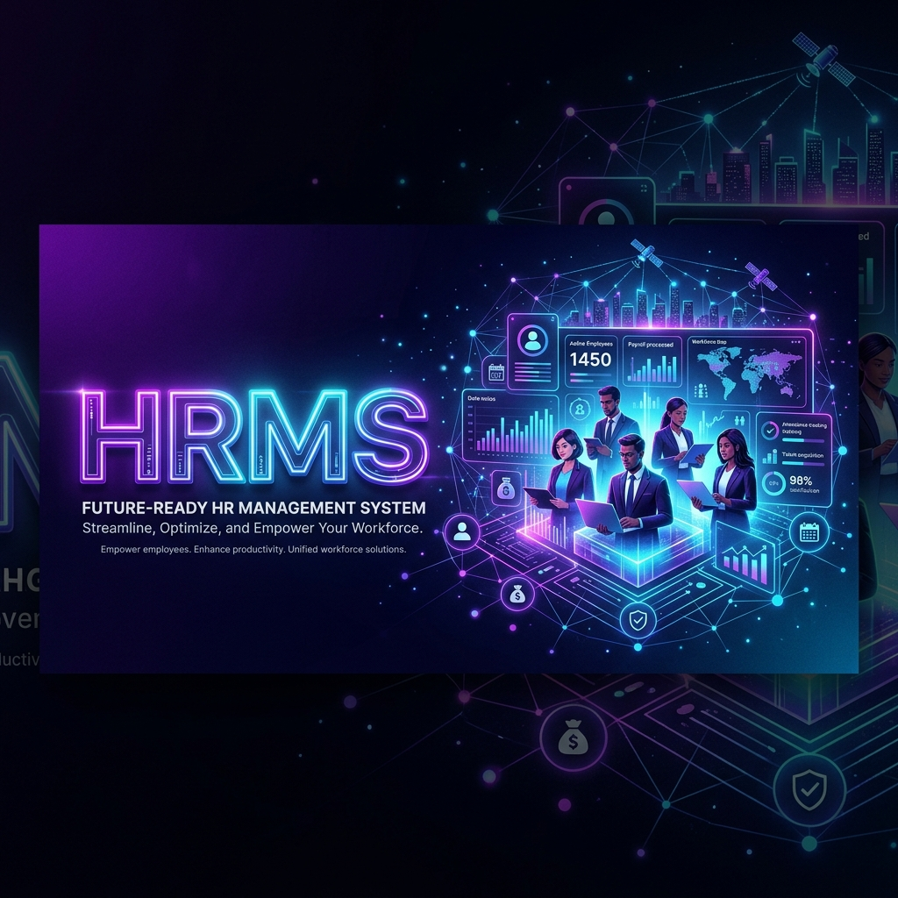
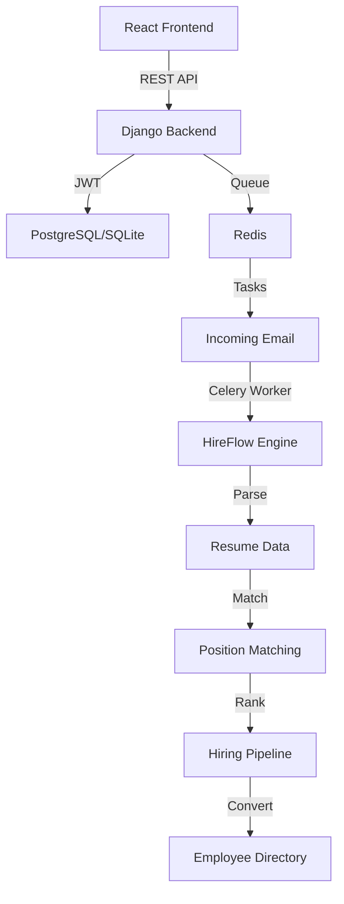
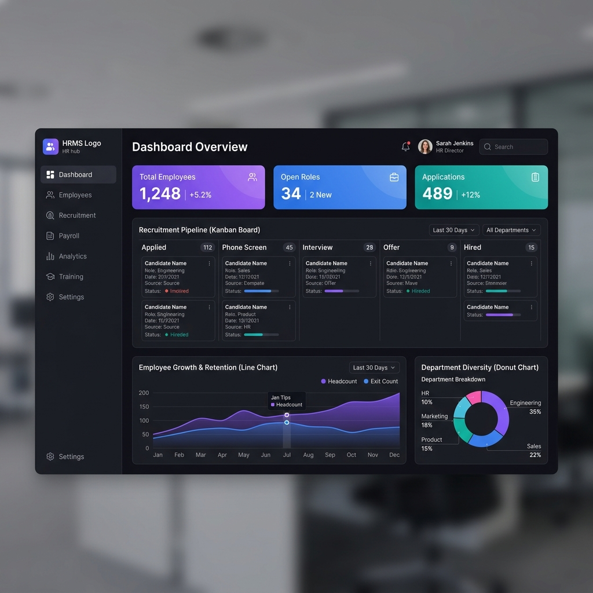
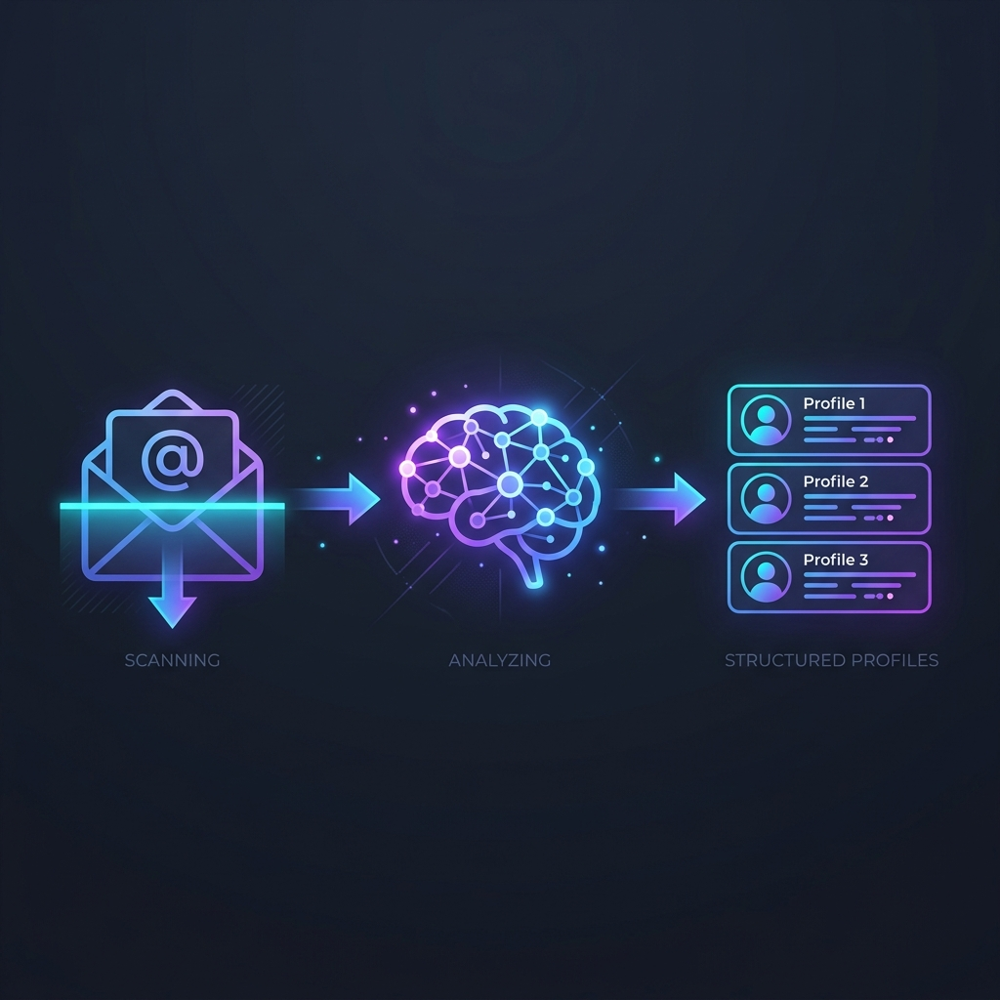

# Advance HRMS (Phase 1)



[](https://www.djangoproject.com/)
[](https://reactjs.org/)
[](https://www.docker.com/)
[](https://docs.celeryq.dev/)

Advance HRMS is a production-grade, AI-driven Human Resource Management System designed to streamline the entire employee lifecycle—from automated recruitment to daily operations management.

*Current Status: Phase 1 (Recruitment & Core IAM) is now live.*

## 🚀 Vision

To eliminate manual overhead in HR departments by leveraging background automation, AI-driven candidate matching, and a seamless "Email-to-Employee" pipeline.

---

## ✨ Key Features

### 🏆 HireFlow (AI Recruitment)
The heart of Phase 1. It automates the sourcing dance:
- **Email Synchronization**: Automatically polls configured HR inboxes for applications.
- **Resume Extraction**: High-fidelity parsing of PDF/DOCX resumes using `pdfminer.six`.
- **Skill Matching**: Ranks candidates based on job position requirements.
- **Pipeline Management**: Transition candidates through Shortlist, Screening, Technical, and Hired stages.
- **Auto-Onboarding**: Convert a hired candidate to an employee with a single click.

### 👤 Identity & Access Management (IAM)
- **Role-Based Access Control (RBAC)**: Fine-grained permissions for HR, Managers, and Employees.
- **JWT Authentication**: Secure stateless sessions for web and future mobile clients.
- **Rich Profiles**: Track employment history, manager hierarchies, and department info.

### 📅 Operational Excellence
- **Attendance Tracking**: Simple daily check-ins with reporting for HR.
- **Leave Management**: Digital workflows for leave applications and approvals.
- **Policy Portal**: Centralized repository for company guidelines and documentation.

### 📧 Integrated Email Client
Manage professional communication without leaving the dashboard. Supports background draft saving and organized thread management.

---

## 🏗️ Architecture



---

## 🖼️ Visual Showcase

### **Modern Dashboard**


### **Automated Pipeline**


---

## 🛠️ Tech Stack

- **Backend**: Python 3.12, Django REST Framework, Celery, Redis.
- **Frontend**: React 18, Vite, Framer Motion, Lucide React.
- **Database**: PostgreSQL (Production) / SQLite (Development).
- **Tooling**: Docker, Docker Compose, ESLint.

---

## 🚦 Getting Started

### Prerequisites
- Docker & Docker Compose
- Node.js (for local frontend development)

### Quick Start with Docker
The entire stack is containerized for consistent development.

1. **Clone the repository**
   ```bash
   git clone https://github.com/ER-DipanshuSaini/advance-HRMS.git
   cd advance-HRMS
   ```

2. **Setup environment**
   ```bash
   cp .env.example .env
   # Edit .env with your credentials
   ```

3. **Spin up the services**
   ```bash
   docker-compose up --build -d
   ```

4. **Initialize Database**
   ```bash
   docker-compose exec backend python manage.py migrate
   docker-compose exec backend python manage.py createsuperuser
   ```

The app will be available at:
- Frontend: `http://localhost:5173`
- Backend API: `http://localhost:8000`

---

## 📁 Project Structure

```text
├── backend/            # Django REST API & Core Logic
│   ├── modules/        # Domain-driven apps (HireFlow, IAM, etc.)
│   ├── core/           # Project configuration
│   └── Dockerfile      # Backend environment
├── frontend/           # React + Vite Application
│   ├── src/            # Components, Hooks, API services
│   └── Dockerfile      # Frontend environment
├── readme_assets/      # Visual documentation assets
└── docker-compose.yml  # Multi-container orchestration
```

---

## 🤝 Contributing

We welcome contributions! Please fork the repository and submit a pull request for any enhancements.

## 📄 License

This project is licensed under the MIT License.
